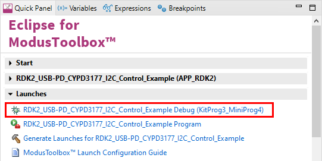

# RutDevKit-PSoC62 USB PD Control Example

Rutronik Development Kit Programmable System-on-Chip CY8C6245AZI-S3D72 "USB Power Delivery Control" Example. 

This example demonstrates how to access and control the CYPD3177 power delivery sink controller.

 

### Using the code example with a ModusToolbox IDE:

1. Import the project: **File** > **Import...** > **General** > **Existing Projects into Workspace** > **Next**.
2. Select the directory where **"RutDevKit-PSoC62_USB_PD_Control"** resides and click  **Finish**.
3. Select and build the project **Project ** > **Build Project**.

### Operation

The firmware is used to check if the USB PD Sink controller is responsive via I2C interface and if it has the power source connected with PD protocol capability it selects new PDO. The user can define what PDOs to use by changing PDO0 and PDO1. Though the CYPD3177 supports up to 7 PDOs, the example will setup only first two as it will replace default setup which is selected by the controller from the voltage dividers on every start up.

```
/* Custom PDOs: */
#define PDO0 0x0201905A /* PDO 0 : 5V, 900mA*/
#define PDO1 0x0002D0C8 /*PDO 1 : 9V, 2000mA*/
```

The PDOs are documented in USB PD specification https://www.usb.org/document-library/usb-power-delivery :


The progress can be seen via KitProg3 UART:


### Debugging

If you successfully have imported the example, the debug configurations are already prepared to use with a the KitProg3, MiniProg4, or J-link. Open the ModusToolbox perspective and find the Quick Panel. Click on the desired debug launch configuration and wait until the programming completes and debugging starts.



## Legal Disclaimer

The evaluation board including the software is for testing purposes only and, because it has limited functions and limited resilience, is not suitable for permanent use under real conditions. If the evaluation board is nevertheless used under real conditions, this is done at one’s responsibility; any liability of Rutronik is insofar excluded. 


